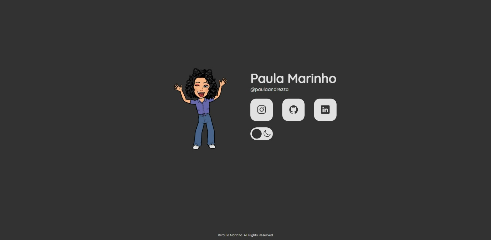
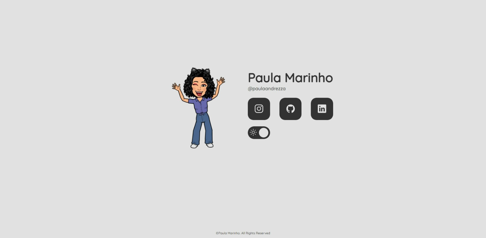
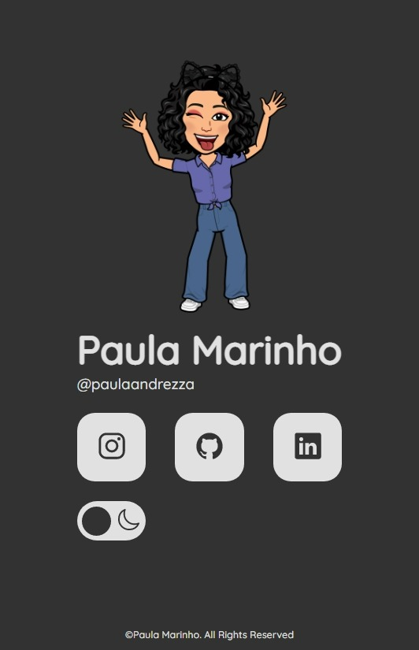
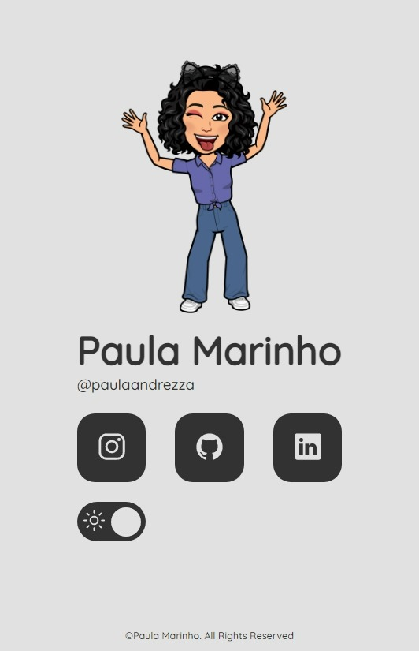

<h1 align="center"> LinkTree </h1>

Repositório para o primeiro desafio da mentoria do programa desenvolve

  <a href="#-tecnologias">Tecnologias</a>&nbsp;&nbsp;&nbsp;|&nbsp;&nbsp;&nbsp;
  <a href="#-projeto">Projeto</a>&nbsp;&nbsp;&nbsp;|&nbsp;&nbsp;&nbsp;
  <a href="#-layout">Layout</a>

 

  
  
  
  

 

## 🚀 Tecnologias

Esse projeto foi desenvolvido com as seguintes tecnologias:

- HTML e CSS
- JavaScript
- LocalStorage

 

## 💻 Projeto

O projeto tem como objetivo a criação de uma página de LinkTree.
Foi utilizado o LocalStorage para armazenar o tema anterior para dark ou light.
Você pode ver o projeto [clicando aqui](https://paulaandrezza.github.io/LinkTree).

 

## 🔖 Layout

Você pode visualizar o layout do projeto através [DESSE LINK](https://www.figma.com/file/qsW8uv5WP26UEqCg36a9GX/Exercicio?node-id=0%3A1&t=Qc2LMmKWoFwP3MxK-0/duplicate). É necessário ter conta no [Figma](https://figma.com) para acessá-lo.